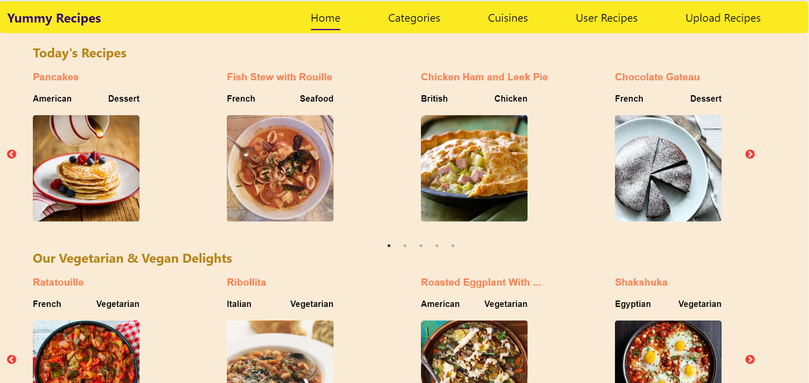
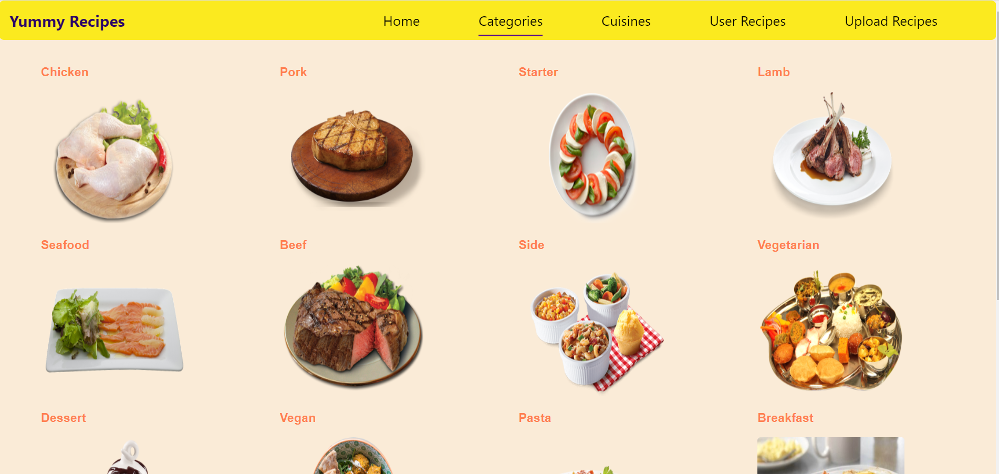
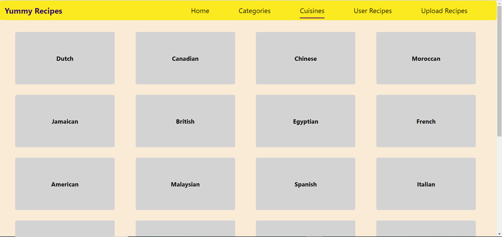
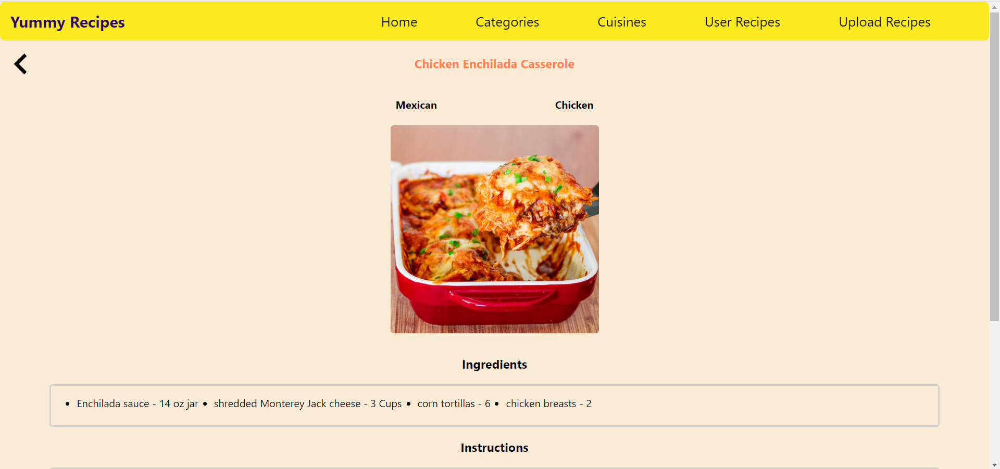
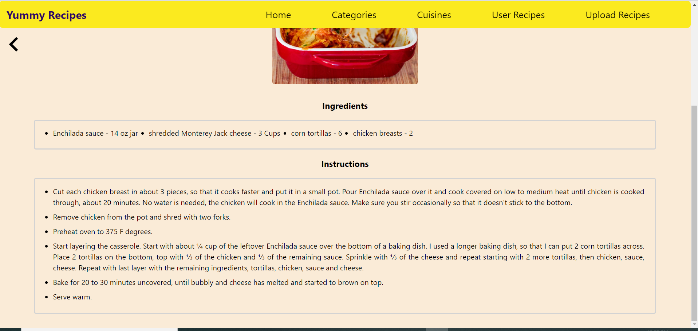
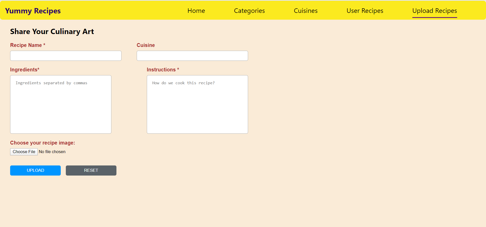
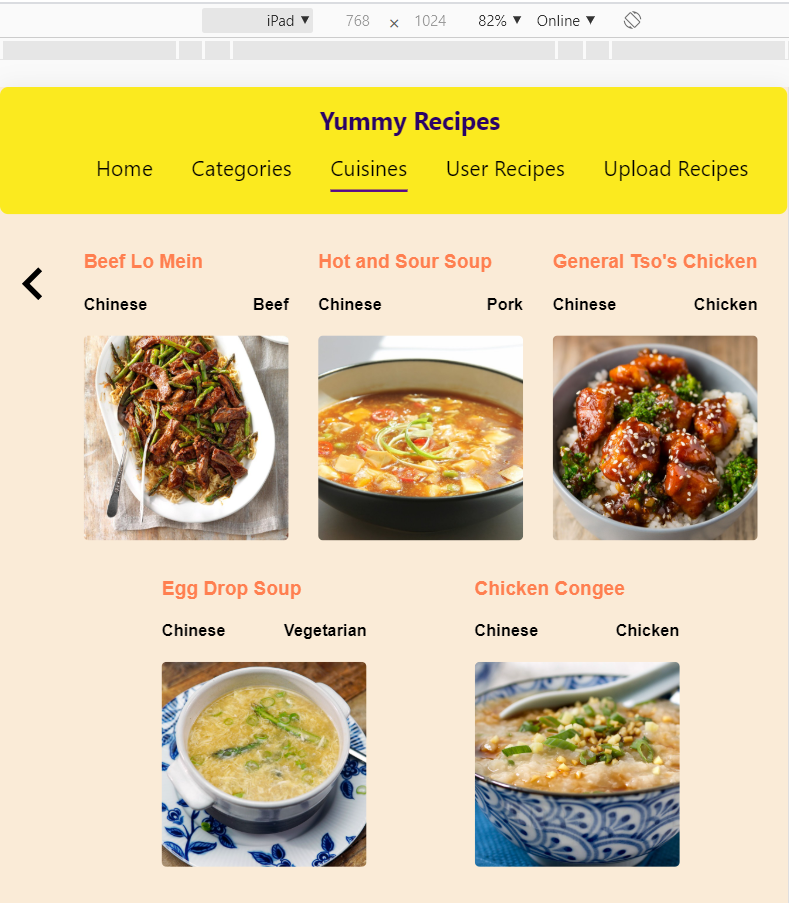
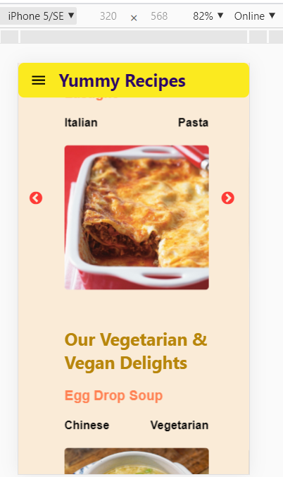
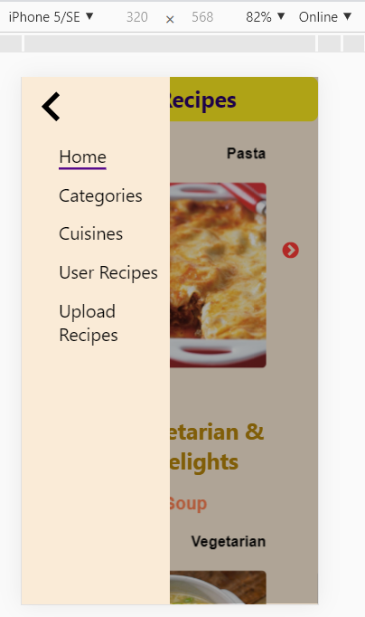

# Yummy Recipes
**_Contents:_**
- [About](#about)
- [Author](#author)
- [Features](#features)
- [Screenshots](#screenshots)

# About

Yummy Recipes is a modern web app that allows users to view and upload home made recipes

**Technology Stack**
- *Front End*: React, SASS
- *Back End*: NodeJS, Express, MongoDB on the cloud, mealdb api

# Author
[Rajat Bansal](https://github.com/rjtbansal)

# Features
- Show top 10 randomized recipes
- Show recipes by categories, cuisines, Guests
- Guest user can upload recipes

# Screenshots
## Home Page

## Categories Page

## Cuisines Page

## Recipe Details 1

## Recipe Details 2

## Recipes By Categories

## Recipes By Cuisines

## Upload Recipes

## Tablet View

## Mobile View

## Mobile Hamburger Menu

